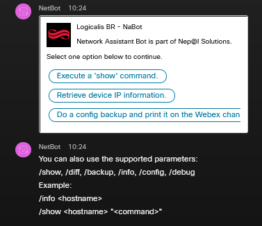

# Cisco Webex Bot with Netbox data source and Nornir/Scrapli automation


[](https://developer.cisco.com/codeexchange/github/repo/LogicalisBR/NaBot)

This is meant to be used as an example on how to build a Cisco Webex Bot
with [netbox](https://github.com/netbox-community/netbox) Integration (via the nornir_scrapli inventory plugin). This
bot is based on [docker-webexteams-bot-example](https://github.com/haskalpa/docker-webexteams-bot-example) and adds [pyadaptivecards](https://github.com/CiscoSE/pyadaptivecards) functionalities for handling user input. The bot is based
on [flask](https://github.com/pallets/flask) and will be configured to receive [webhooks](https://developer.webex.com/docs/api/guides/webhooks) via http requests using [ngrok](https://ngrok.com/).

The bot allows users to input actions to be executed (currently allows to
run EXEC mode commands and generate configuration backups for 
single Cisco devices) and receive the outputs directly on their Webex 
conversation.

Platforms where the automation backend was tested:
- Cisco IOS XR
- Cisco IOS XE

Since the backend relies on nornir and scrapli, this should also work on Cisco IOS devices and Juniper JUNOS devices.

## Table of Contents
1. [Prerequisites](#prerequisites)
2. [Create Bot Account on Webex](#webex)
3. [Setup Network Assistant Bot](#setup)
4. [Setup Netbox Inventory](#netbox)
5. [Test nornir backend locally](#nornir)
6. [Start a Conversation with the Bot](#conversation)
7. [FAQ](#faq)

## Prerequisites
<a href="#prerequisites"></a>
Most of the software will be installed inside a container running on docker.
- Docker-compose
- Git

## Create Bot account on Webex
<a href="#webex"></a>

You will need to create the bot and generate and API token from [developer.webex.com](https://developer.webex.com). Be sure to save the API token once it's created as you'll need it when setting up the bot!

# Setup Network Assistant Bot
<a href="#setup"></a>

Git clone this repository to a local directory:
```
cd /path/to/local/repository/
git clone --recurse-submodules https://github.com/LogicalisBR/NaBot.git
```

The file network_assistant_bot/netbox_config.yaml is a *nornir* configuration file. The Netbox URL should be changed to point to your local host's IP address and port number (not localhost).

Also, update the config/config.yaml file with the Token you previously generated for your bot. This is how the Bot will authenticate with the Webex API.

Build the local docker container environment:
```
docker-compose build
docker-compose up -d
```

Two containers will be instanced:
1. *network_assistant_bot* automatically mounts the network_assistant_bot/, helpers/ and config/ directories, so you can customize the code and configuration on these directories.
2. *netbox* will be available locally on port 8000 (open a web browser and visit localhost:8000).

## Setup Netbox Inventory
<a href="#netbox"></a>

Default credentials to the Netbox container are:
- *username*: admin
- *password*: admin
- *api key*:0123456789abcdef0123456789abcdef01234567

You must supply the API key to the nornir_config_example.yaml file for it to be used
as an inventory. The nornir config file is also read by the Netbox helper script to automatically onboard devices on Netbox using its URL and token.
```yaml
---
inventory:
  plugin: NetBoxInventory2
  options:
    nb_url: <NETBOX_URL>         # URL in the format http://<ip-address>:<port-number>
    nb_token: <NETBOX_API_TOKEN> # API Token for Netbox
    ssl_verify: False
  transform_function: "convert_host_data"

runner:
  plugin: threaded
  options:
    num_workers: 10

ssh:
  config_file: '../ssh_config'
```

A Netbox helper script was written to facilitate device onboarding with some sample devices from the always-on Cisco's [Devnet Sandbox](https://developer.cisco.com/site/sandbox/). The script can be found under helpers/netbox_helper.py. The devices to be onboarded are listed in a yaml file (config/devices.yaml) and by default contains two DevNet routers (iosxr1 and csr1000-v from the IOSXR and IOSXE always-on labs). More devices can be onboarded by adding more elements to the YAML file.
```yaml
devices:
  - name: <hostname>  # Must be identical to the hostname on the device
    site: <site>      # Free form string for Netbox site
    tenant: <tenant>  # Free form string for Netbox tenant
    platform: 
      name: <platform>  # must be either cisco_ios, cisco_iosxr or cisco_iosxe, used by Scrapli
      manufacturer: <manufacturer> # Free form string for manufacturer name
    type:
      name: <name>    # Free form string for Netbox device type
      model: <model>  # Free form model for Netbox device model
    role: <role>      # Free form string for Device Role
    status: Active
    interfaces:
      Loopback0:
         ipv4_address: <ipv-address> # IP of the device with mask, X.X.X.X/X
         primary: Yes       # One primary IP Address MUST be specified, used by scrapli
```
The onboarding script reads from the config/devices.yaml file and automatically onboards the devices, including their interfaces and IP Addresses, if multiple exists.

To execute the onboarding, enter the Nabot container and run it:
```bash
docker exec -it <container-id> /bin/bash
cd /workspace/helpers/
python3 netbox_helper.py
```

## Test Nornir backend locally
<a href="#nornir"></a>
Once you have at least one host on your inventory, you can use the *network_assistant_bot/nornir_helper.py* file from the CLI in order to test if the nornir-scrapli backend is running correctly. The input is of the format:

The back-end can be tested from inside the running container:
```bash 
docker exec -it <container-id> /bin/bash
```

```
python3 nornir_helper.py [hostname] [--inventory] [--exec COMMAND] [--backup]
```

For example, this command would print out the Nornir dictionary for host iosxr1, with all data it gathered from Netbox in dictionary format, excluding password.
```
python3 nornir_helper.py iosxr1 --inventory
```

The syntax can be used to run arbitrary exec mode commands.
```
python3 nornir_helper.py iosxr1 --exec "show ip int brief"
```

Sample test result:


## Open a conversation with the Bot
<a href="#conversation"></a>

Once the bot is running on its container, you can open a new conversation with the bot using the e-mail address you configured previously (<bot-name>@webex.bot). In order to talk to it, mention it in a message with @<bot-name>. This will bring up the adaptive card requiring one ACTION to be used, these are:
- INFO will print the IP address for the given device name on Netbox
- DEBUG will print the IP address for the given device name on Netbox
- EXEC will execute a EXEC command on the device (same as --exec on the CLI), also requires the command to be specified as input
- BACKUP will generate a config backup in text format and print it on the Webex channel (in the future, backups will be handled as file attachments)

# Custom device credential vaults
Separate NetBox tenants are used to derive the authentication credentials on devices. Consult the function *convert_host_data* for details and examples. Native Netbox does not have support for secrets, so instead we populate the username and password fields on the host dictionary with hardcoded values (username = admin, password = C1sco12345 for most devnet always-on sandboxes) if they are on the Sandbox tenant.

If the device does not belong to the Sandbox tenant, a function set_secret_credentials is imported from the helpers/credential_helper.py and used as a transform to provide authentication credentials. You must supply this file yourself or customize the code under convert_host_data in order to assign host.username and host.password to each device.

# Base Images
The following base docker images were used to faciliate development of this Webex Bot:
1. [docker-webexteams-bot-example](https://github.com/haskalpa/docker-webexteams-bot-example)
2. [netbox-docker](https://github.com/netbox-community/netbox-docker)

## FAQ
<a href="#faq"></a>

### I've run 'run_nabot.sh' and got the following error:
``
$ ./run_nabot.sh
Error response from daemon: No such container: nabot
Error: No such container: nabot
```

- Just wait a couple of seconds before trying again
